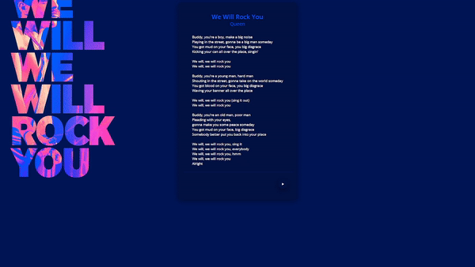
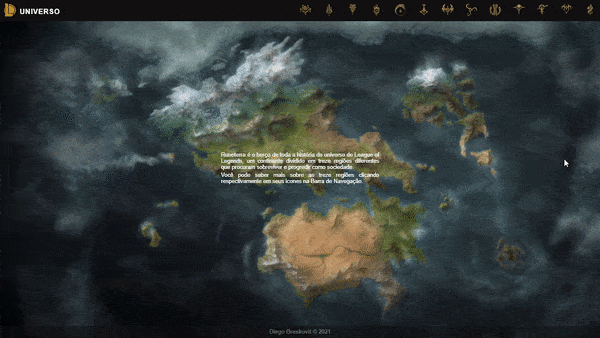
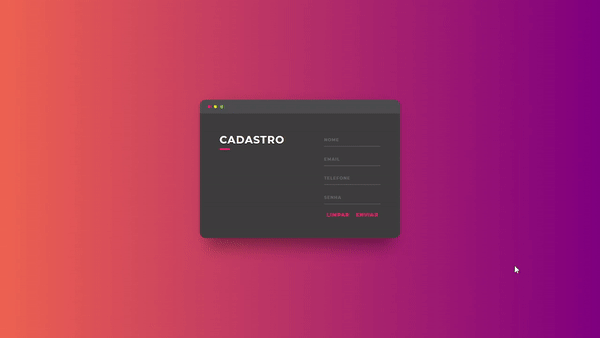

<p align="center">
  
</p>

<h1 align="center">HTML 5</h1>
<p align="center">Projects developed in the programming class of the 2nd year of high school.</p>

<h3 align="center">

 <!-- Status -->
 

 <!-- License -->
  <a href="./LICENSE" target="_blank">
    
  </a>

 <!-- Forks -->
 

 <!-- Stars -->
 

</h3>

<br>

## 🧪 Technologies

-  | [HTML5](https://developer.mozilla.org/pt-BR/docs/Web/HTML)
-  | [CSS3](https://developer.mozilla.org/pt-BR/docs/Web/CSS)
-  | [Javascript](https://developer.mozilla.org/pt-BR/docs/Web/JavaScript)

<h3 align="center">
  
  
  
  
</h3>

## 🚀 Getting started

Clone the project and access the folder.

```bash
$ git clone https://github.com/dbreskovit/HTML
$ cd HTML
```

Follow the steps below:

```bash
# Open the project in Visual Studio Code
$ code .
```

Use the <kbd><a href="https://marketplace.visualstudio.com/items?itemName=ritwickdey.LiveServer" style="color:#9644CD;">Live Server</a></kbd> extension to navigate between project directories.

#

<p align="center">
    <sub>Copyright © 2022 - dbreskovit</sub><br>
    <sub>Made with 💜 by <a href="https://github.com/dbreskovit" style="text-decoration: none;color: #9644CD;">dbreskovit</sub></a>
</p>
